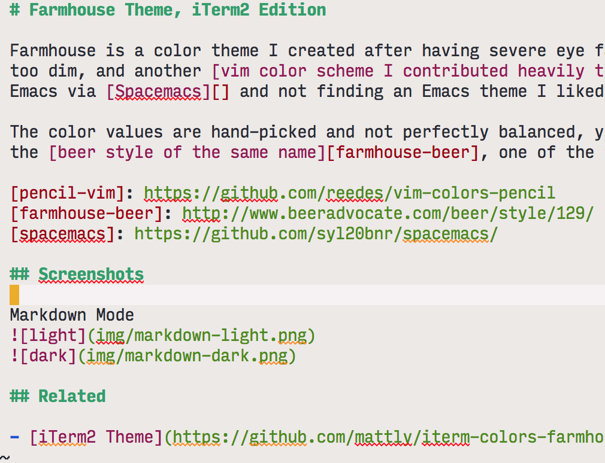
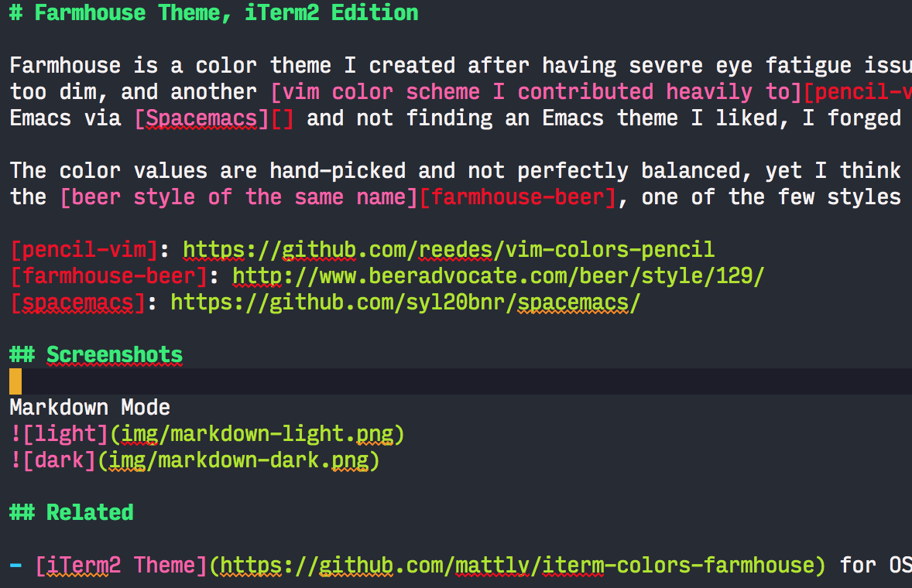
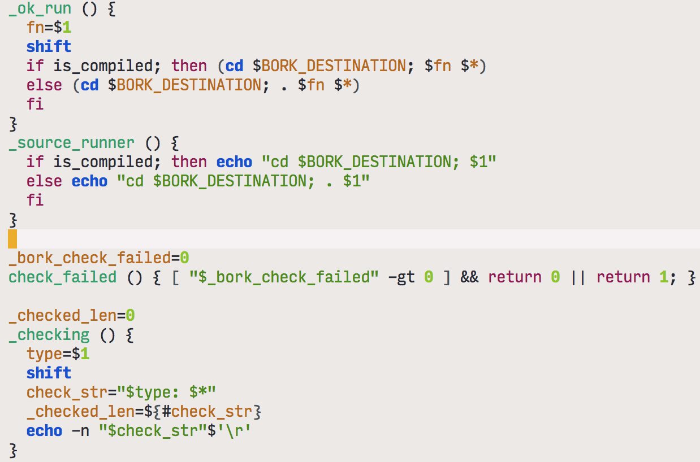
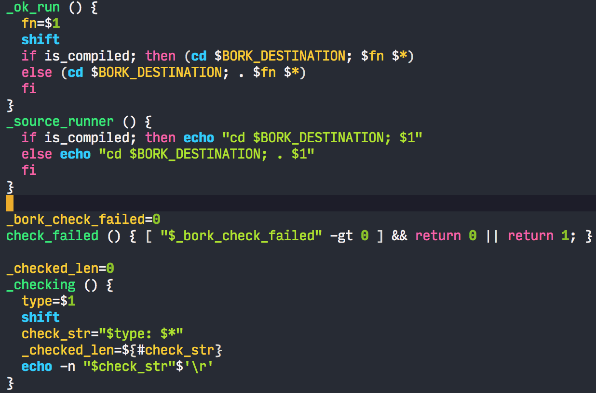
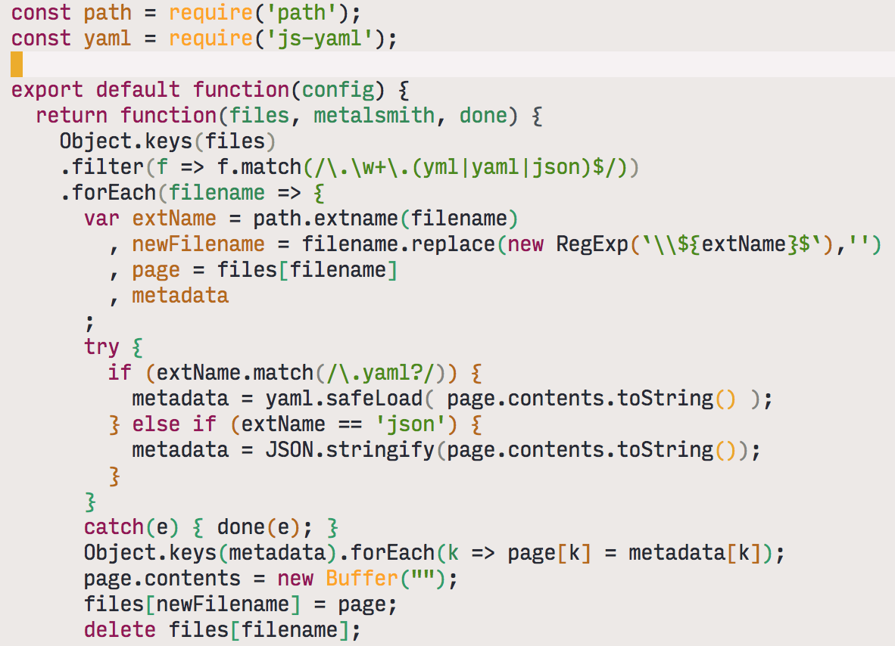
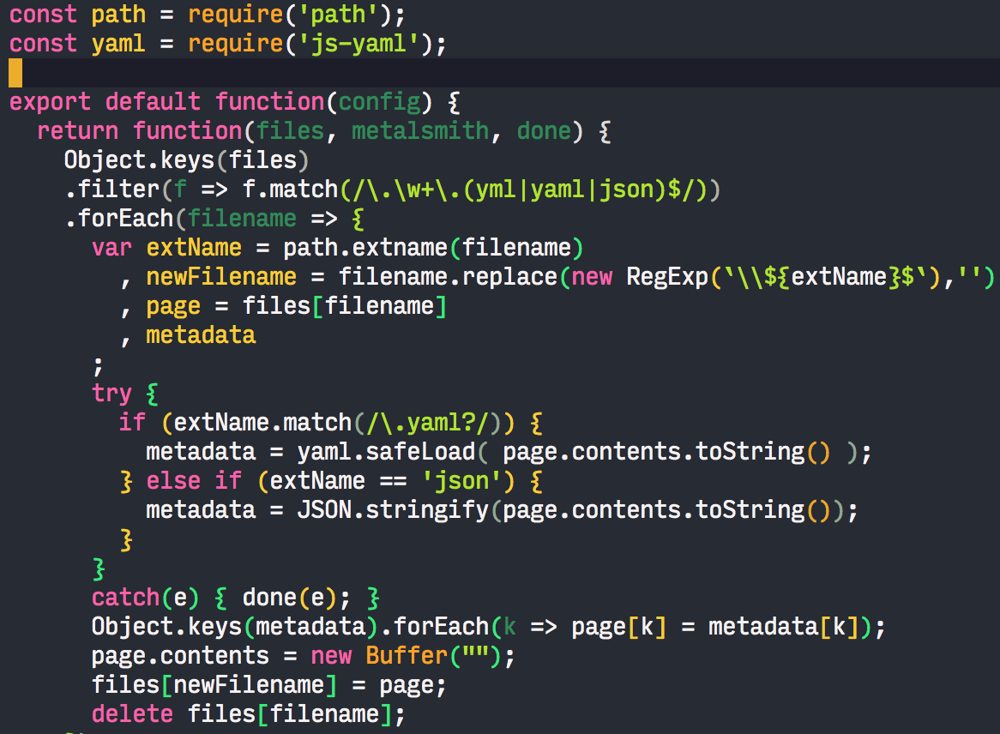
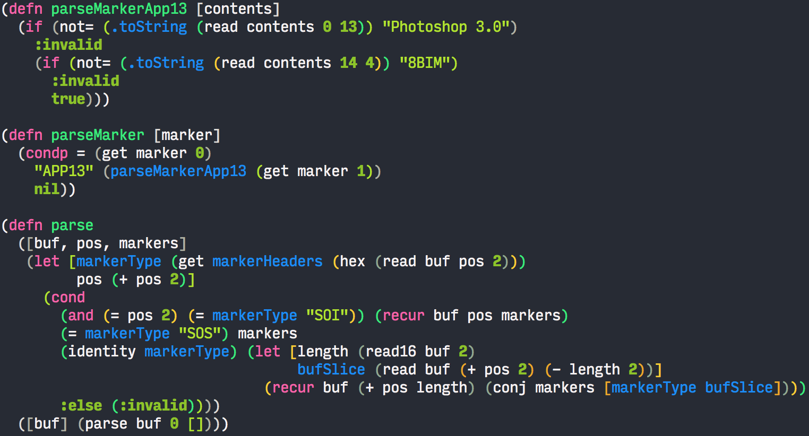

# Farmhouse Theme, Emacs Edition

Farmhouse is a color theme I created after having severe eye fatigue issues with a popular "Mathematically Perfect" color scheme that was too dim, and another [vim color scheme I contributed heavily to][pencil-vim] that after a while I found too bright.  Upon switching to Emacs via [Spacemacs][] and not finding an Emacs theme I liked, I forged this.

The color values are hand-picked and not perfectly balanced, yet I think quite pleasing to the eye.  The name *farmhouse* is derived from the [beer style of the same name][farmhouse-beer], one of the few styles where the fermentation process isn't strictly controlled.

[pencil-vim]: https://github.com/reedes/vim-colors-pencil
[farmhouse-beer]: http://www.beeradvocate.com/beer/style/129/
[spacemacs]: https://github.com/syl20bnr/spacemacs/

## Caveats

1. Requires Emacs 24 or newer.
2. This is a work in progress.  In particular, I want to flesh out org-mode a bit more.  Emacs themes are quite a bit more involved than vim themes -- each mode has its own set of faces to set, and they're not documented well.  At least we have helm-colors.
3. I am still new to Emacs, so if I'm doing something horribly wrong, please file a ticket.
4. Doesn't yet work in the terminal properly.

## Installation

I am currently submitting this to [MELPA](http://melpa.org/), however in the meantime you can clone it down and require it manually by adding the following to your `.emacs` file:

```
(add-to-list 'custom-theme-load-path "/path/to/farmhouse-theme")
(load-theme 'farmhouse-light t)
```

## Screenshots

### Markdown Mode



### Bash



### Javascript



### Clojure



## TODO

- set faces for more of Org-mode

## Related

- [iTerm2 Theme](https://github.com/mattly/iterm-colors-farmhouse) for OS X Users
